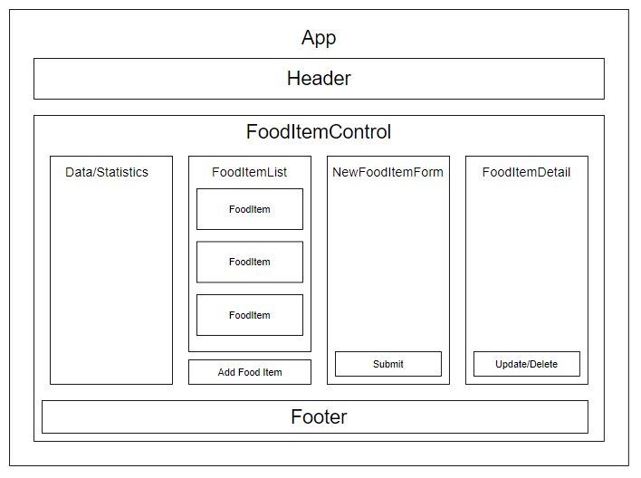

# _Heartburn Tracker Website - Capstone Project_

#### _This heartburn tracker website will allow a user to sign in and submit eaten food items and confirm if there is heartburn or not, 12/11/2020_

#### By _Jeff Dinsmore_

### Table of Contents
* <a href="#description">Description</a>
* <a href="#items-needed-for-mvp">Items Needed for MVP</a>
* <a href="#articles-of-info-to-help-build-the-website">Articles of Info to Help Build the Website</a>
  * <a href="#firebase-hosting">Firebase Hosting</a>
  * <a href="#login-and-authentication">Login and Authentication</a>
  * <a href="#react-routing-info">React Routing Info</a>
  * <a href="#react-hooks">React Hooks</a>
  * <a href="#data-structuring-firestore">Data Structuring Firestore</a>
  * <a href="#firestore-querying">Firestore Querying</a>
  * <a href="#styling-components">Styling Components</a>
* <a href="#component-diagram">Component Diagram</a>
* <a href="#setupinstallation-requirements">Setup/Installation Requirements</a>
* <a href="#known-bugs">Known Bugs</a>
* <a href="#support-and-contact-details">Support and Contact Details</a>
* <a href="#technologies-used">Technologies Used</a>
* <a href="#license">License</a>

## Description

_The heartburn tracker website is designed to follow a persons path of heartburn by having the person input food they ate, the ingredients, and then submit if they had heartburn or not. Algorithms will then analyze the data to see if there are common trends in the ingredients of food and the instances of heartburn and will show this data on the website._

## Items Needed for MVP

* _Login capability - each user will have their own login that tracks and records their personal data and inputs_
* _Website will receive three inputs - A user will input three fields of data: food item, ingredients of this food item, and if they have heartburn or not_
* _NoSQL will be used for the data to be stored from each user and called upon as needed_
* _Website will show in list and detail format the inputs received above and give the user the option to delete and edit these fields_
* _An algorithm will be working in the background to match specific ingredients to instances of heartburn and display these ingredients on the home page_

Further Capstone Info Listed Below

## Articles of Info to Help Build the Website

### Firebase Hosting
* _Firebase hosting - https://firebase.google.com/docs/hosting/custom-domain_
* _Firebase hosting rules - https://firebase.google.com/docs/rules_

### Login and Authentication
* _Login and authorization - https://auth0.com/_
* _Firebase Authentication - https://firebase.google.com/docs/auth_
* _React authentication flow - https://reactrouter.com/web/example/auth-workflow_
* _React Firebase Authorization recipes - http://react-redux-firebase.com/docs/recipes/auth.html_
* _Handling user authentication - https://blog.logrocket.com/user-authentication-firebase-react-apps/_

### React Routing Info
* _React Router quick-start - https://reactrouter.com/web/guides/quick-start_
* _React Routing tutorial - https://reactrouter.com/web/example/basic_

### React Hooks
* _Hooks documentation - https://reactjs.org/docs/hooks-intro.html_
* _Hooks tutorial - https://youtu.be/dpw9EHDh2bM_

### Data Structuring Firestore
* _Data structures for firestore - https://firebase.google.com/docs/firestore/manage-data/structure-data_

### Firestore Querying
* _Simple & compound queries - https://firebase.google.com/docs/firestore/query-data/queries_
* _Queries with Indexing - https://firebase.google.com/docs/firestore/query-data/indexing_

### Styling Components
* _Styled components documentation - https://styled-components.com/docs_

## Component Diagram

## Setup/Installation Requirements

* _Clone this repository_
* _Open repository in your preferred code builder program. (This was built in VS Code)_
* _In the terminal, cd into the heartburn-tracker-react folder_
* _Type in the terminal "npm install" and press enter_
* _To run the program, type "npm run start" in the terminal_
* _The program should now be running_

## Known Bugs

_No known bugs at the this time._

## Support and Contact Details

_Any known issues, please reach out to Jeff Dinsmore by email at hello@jeffdinsmore.com._

## Technologies Used

* _React_
* _Redux_
* _JavaScript_
* _JSX_
* _CSS_
* _VS Code_
* _NoSQL - Firebase/Firestore_

## License

Copyright (c) 2020, **_Jeff Dinsmore_**

This software is licensed under the MIT license.

----------------------------------------------------------------

# Getting Started with Create React App

This project was bootstrapped with [Create React App](https://github.com/facebook/create-react-app).

## Available Scripts

In the project directory, you can run:

### `npm start`

Runs the app in the development mode.\
Open [http://localhost:3000](http://localhost:3000) to view it in the browser.

The page will reload if you make edits.\
You will also see any lint errors in the console.

### `npm test`

Launches the test runner in the interactive watch mode.\
See the section about [running tests](https://facebook.github.io/create-react-app/docs/running-tests) for more information.

### `npm run build`

Builds the app for production to the `build` folder.\
It correctly bundles React in production mode and optimizes the build for the best performance.

The build is minified and the filenames include the hashes.\
Your app is ready to be deployed!

See the section about [deployment](https://facebook.github.io/create-react-app/docs/deployment) for more information.

### `npm run eject`

**Note: this is a one-way operation. Once you `eject`, you can’t go back!**

If you aren’t satisfied with the build tool and configuration choices, you can `eject` at any time. This command will remove the single build dependency from your project.

Instead, it will copy all the configuration files and the transitive dependencies (webpack, Babel, ESLint, etc) right into your project so you have full control over them. All of the commands except `eject` will still work, but they will point to the copied scripts so you can tweak them. At this point you’re on your own.

You don’t have to ever use `eject`. The curated feature set is suitable for small and middle deployments, and you shouldn’t feel obligated to use this feature. However we understand that this tool wouldn’t be useful if you couldn’t customize it when you are ready for it.

## Learn More

You can learn more in the [Create React App documentation](https://facebook.github.io/create-react-app/docs/getting-started).

To learn React, check out the [React documentation](https://reactjs.org/).

### Code Splitting

This section has moved here: [https://facebook.github.io/create-react-app/docs/code-splitting](https://facebook.github.io/create-react-app/docs/code-splitting)

### Analyzing the Bundle Size

This section has moved here: [https://facebook.github.io/create-react-app/docs/analyzing-the-bundle-size](https://facebook.github.io/create-react-app/docs/analyzing-the-bundle-size)

### Making a Progressive Web App

This section has moved here: [https://facebook.github.io/create-react-app/docs/making-a-progressive-web-app](https://facebook.github.io/create-react-app/docs/making-a-progressive-web-app)

### Advanced Configuration

This section has moved here: [https://facebook.github.io/create-react-app/docs/advanced-configuration](https://facebook.github.io/create-react-app/docs/advanced-configuration)

### Deployment

This section has moved here: [https://facebook.github.io/create-react-app/docs/deployment](https://facebook.github.io/create-react-app/docs/deployment)

### `npm run build` fails to minify

This section has moved here: [https://facebook.github.io/create-react-app/docs/troubleshooting#npm-run-build-fails-to-minify](https://facebook.github.io/create-react-app/docs/troubleshooting#npm-run-build-fails-to-minify)
